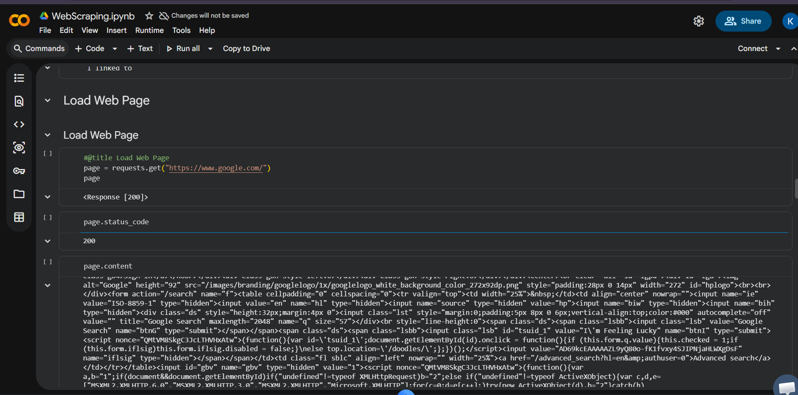
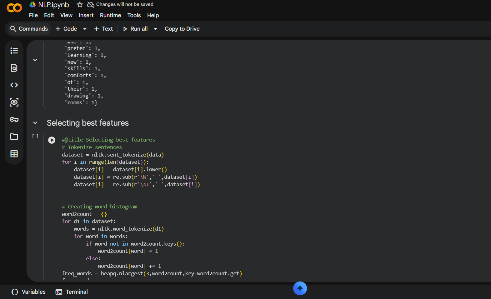
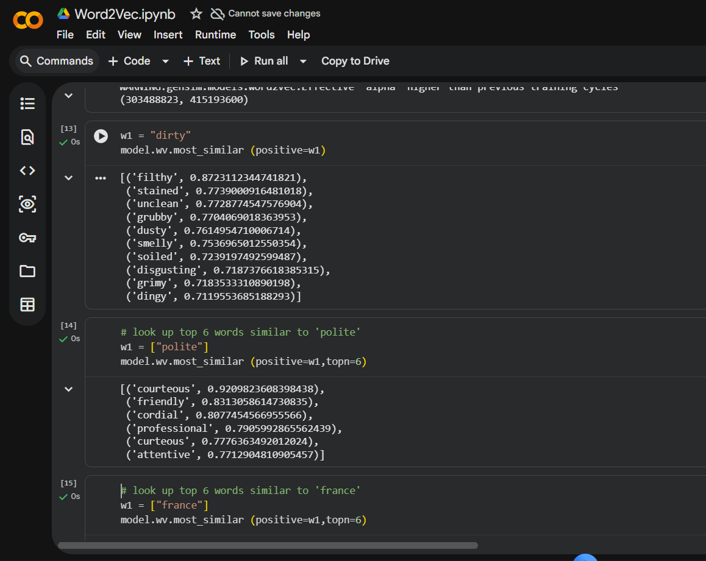
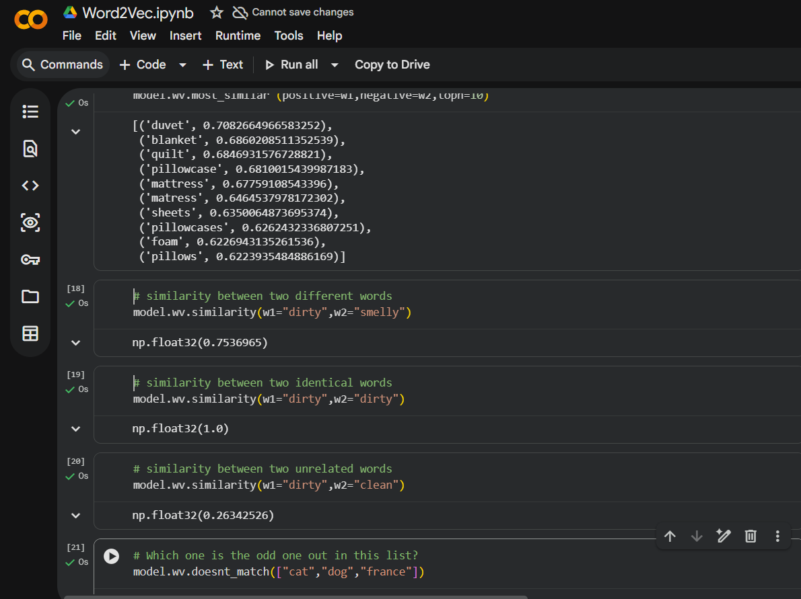

# Milestone 1

## Project Overview

Milestone 1 focuses on building the initial version of the Freight Quote AI project. The objective is to understand the dataset, prepare it for analysis, and create the first machine learning workflow for freight cost prediction.

---

## Features Implemented

- Data loading
- Data preprocessing
- Data cleaning
- Feature selection
- Exploratory Data Analysis (EDA)
- Initial Machine Learning Model
- Prediction of freight cost

---

## Tech Stack

- Python
- Jupyter Notebook
- Pandas
- NumPy
- Matplotlib
- Scikit-learn

---

## How to Run

1. Clone the repository.
2. Open the Milestone1 folder.
3. Install the required Python libraries.

```
pip install pandas numpy matplotlib scikit-learn
```

4. Open the notebook.

```
FreightQuoteAI.ipynb
```

5. Run all the cells in Jupyter Notebook.

---

## Dataset


## Data Cleaning


## Model Training


## Prediction Output



